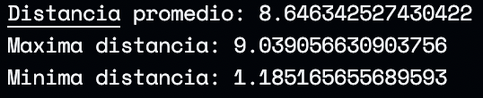

# Caminante aleatorio

## Resumen
Un caminante en un espacio 2 dimensional puede desplazarse en el plano con la misma probabilidad en las direcciones:
* Arriba
* Abajo
* Izquierda 
* Derecha

Con lo anterior, se busca conocer lo siguiente:
1. ¿Cómo cambia la distancia esperada al origen en función de n? ¿Cómo cambia la distancia mínima y máxima al origen?
2. ¿Cuál es la probabilidad de que después de n pasos se encuentre a una distancia normal (Manhattan cityblock) de sqrt(n) o menos?

## Solución
Se generó un código con la siguiente estructura

```bash
Scripts/
    Procesos.py
    Graficos.py
main.py
```

El archivo *main.py* permite observar el movimiento de los caminantes con una configuración pre-establecida, para modificar los valores, cambie las variables globales. Las figuras se obtuvieron después de correr el archivo con los siguientes parámetros

```python
CENTRO = (0,0)
N_CAMINANTES = 5
N_PASOS = 100
N_REPETICIONES = 100
DISTANCIA = 'euclidiana'
```

:::image type="content" source="Resultados/Figure_1.png" alt-text="Caminanata para 5 caminantes":::
:::image type="content" source="Resultados/Figure_2.png" alt-text="Caminos promedios":::

1. ¿Cómo cambia la distancia esperada al origen en función de n? ¿Cómo cambia la distancia mínima y máxima al origen?

