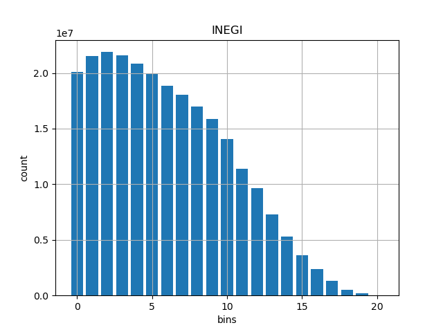
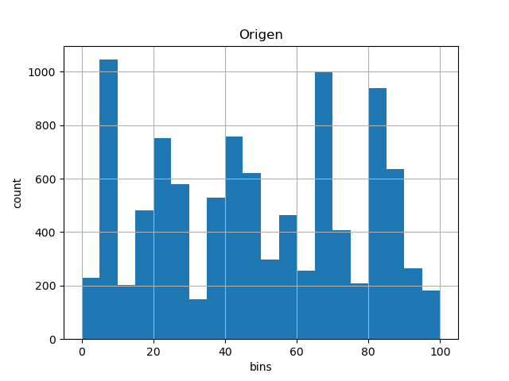
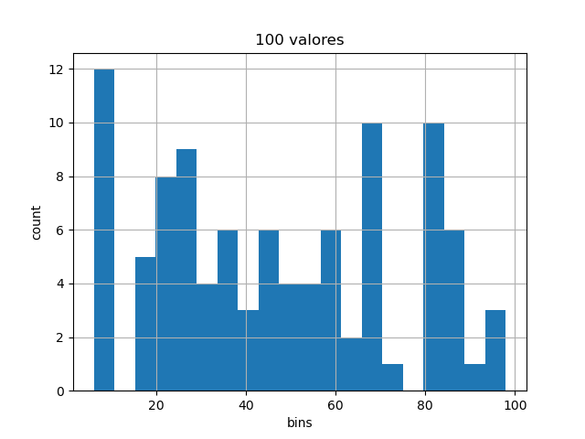
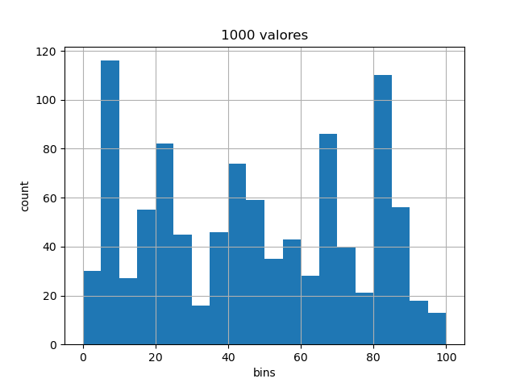
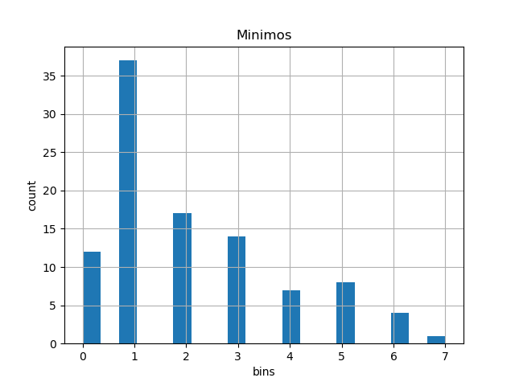
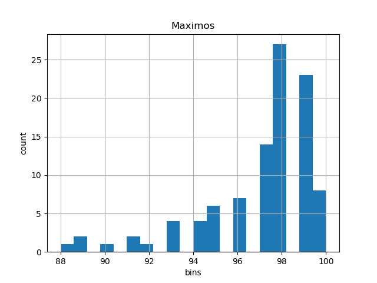
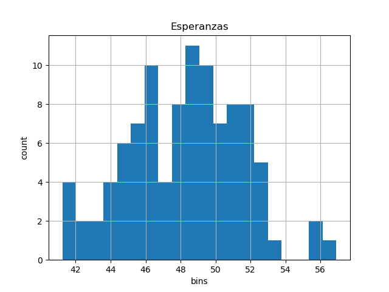

# MUESTREO Y ESTIMACIÓN DE DISTRIBUCIONES

## Resumen
La información del [INEGI](https://www.inegi.org.mx/app/tabulados/interactivos/?pxq=Poblacion_Poblacion_01_e60cd8cf-927f-4b94-823e-972457a12d4b&idrt=123&opc=t) nos permite conocer la distribuciones de edades del país desde 1990.



Después de extraer la media y la desviación estandar, se generó un vector de tamaño 10000 con el que se desarrollaron las diferentes actividades.

## Resultados
Para una muestra de $N=10000$ habitantes para un rango de edad de 0 a 100 con media $\mu\approx 0.05$ y desviación estandar $std\approx 0.03$ se obtuvo la siguiente distribución



Sobre este conjunto de datos se hizo dos estracciones, la primera con 100 parámetros y la segunda con 1000




Después con el mismo conjunto inicial, se realizaron $$L=100$$ iteraciones para extraer subconjuntos de tamaño $$N=100$$ a esos subconjuntos se les extrajo el mínimo, máximo y valor esperado. Sus gráficas se muestran a continuación.





## Código
Para hacer una replicación de los datos modifique el path donde se encuentre el archivo inicial y después ejecute el main

En main.py modificar PATH
```python
L = 100
N = 100
PATH = None
```

Después ejecutar main.py
```bash
python main.py
```

## Conclusiones
Tengo duda de la forma en que genere los nuevos valores porque no se parecen a la distribución original, también porque recuerdo que una vez hice lo mismo de otra forma, considerando la probabilidad acumulada. 

Las figuras tienen diferentes formas y en ninguna podría decir que los datos se distribuyen de forma normal, salvo en la última gráfica, la de las esperanzas. En ella sí se observa una distribución normal.