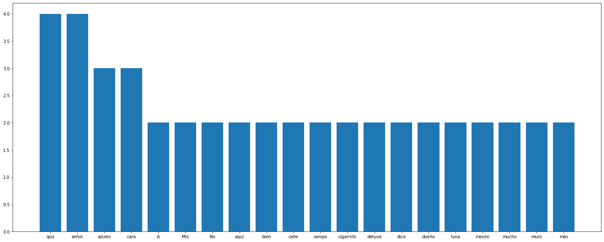

# Mineria de Textos

Para poder usar las funciones que se muestran aqui es necesario tener las siguientes librerias:
* nltk
* spacy
* matplotlib

Y descargar los lenguajes de español de spacy y los archivos que le hicieran falta a nltk.

En el archivo ejemplo se muestra un análisis simple del texto **El ramo azul** de Octavio Paz usando las herramientas generadas en el archivo python, revisa que los nombres de las importaciones sean correctas y ejecuta el nootbook. 

Sientete libre de usar, modificar y mejorar las funciones que se realizarón en este archivo pero colocalo en una nueva rama aquí o duplica el proyecto en tu propio repositorio, no olvides linkearme para que otros accedan a los códigos que se generan.

La figura de abajo es un ejemplo de lo que se puede lograr usando las funciones.

